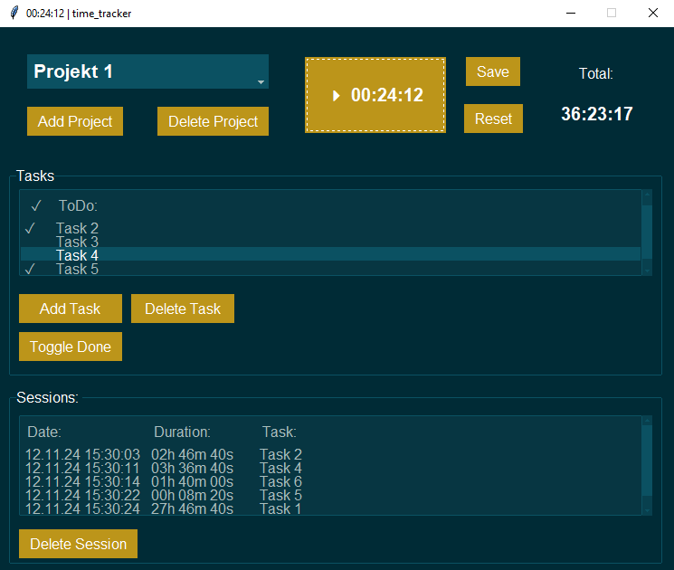

# time_tracker_python
Ein einfaches Programm, um Projekten Arbeitszeit und Aufgaben zuzuweisen.

Die Datenbank wurde mit SQLite realisiert.
Die graphische Benutzeroberfläche mit Tkinter.

## Gelernte Fähigkeiten:
- Schnittstelle Python und SQLite
- Tkinter Basics
- Error-Handling Basics
- Python virtual environments
- git Basics

## Verbesserungspotential:
- Programmstruktur besser planen, vor allem in Bezug auf OOP, Kapselung und Separation von Verantwortlichkeiten
- früher und mehr modularisieren, Skripte sind zu lang geworden

## ToDos:
- Löschung von Tasks zu dem Zeitpunkt an dem auch der zugehörige Log gelöscht wurde
- gui sollte nicht bei Modulimport aufgebaut werden, sondern in main.py 
- Modularisierung & OOP: gui Skript
- Modularisierung & OOP: project_handler Skript
- Import/Export Funktionalität
- Validation der Zeichenkettelänge von Projektnamen und Taskbeschreibungen

# Fazit:
Das Programm funktioniert so, wie ich es mir vorgestellt habe, aber in Bezug auf Wartbarkeit gibt es Verbesserungspotenzial.
Der Code enthält einige unvorteilhafte Strukturen, die es erschweren, effizient zu refaktorisieren – besonders in den Bereichen OOP und Modularisierung.
Die Projektkomplexität hat sich umfangreicher entwickelt, als ursprünglich erwartet.
Die verbleibenden ToDos könnten noch umgesetzt werden, jedoch würde ich bei künftigen Projekten von einem modulareren Ansatz und einer sorgfältigeren Planungsphase profitieren

Ich erwarte das ich mit **mehreren kleinen Projekten mehr lernen werde**, um dann mein Wissen bei komplexeren Projekten anwenden zu können.

## Requirements | Bibliotheken:
Die genutzten Bibliotheken sind in `requirements.txt` hinterlegt.

Installation mit pip:

`pip install -r requirements.txt`

